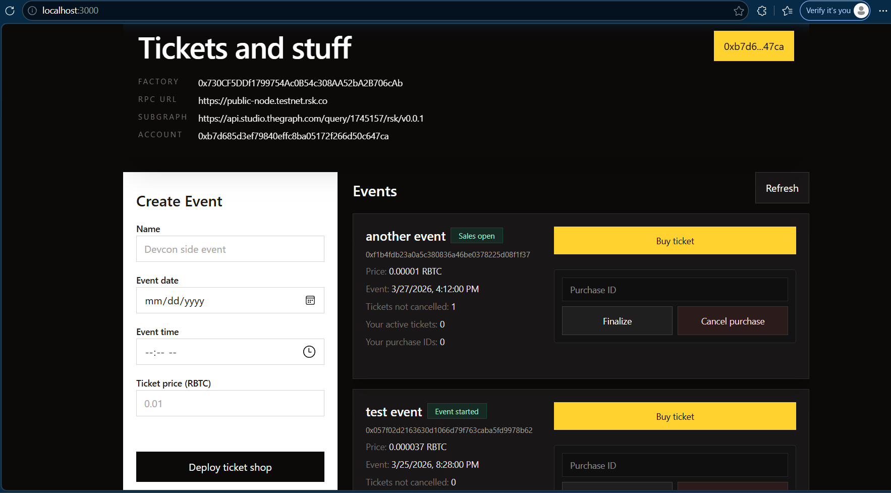

# Time-based ticket release dApp




## Use the app
- deploy `TicketShopFactory` contract 
- deploy a new `TicketShop` through the `TicketShopFactory`
- buy a ticket with `queue()` before event starts
- refund a queued purchase with `cancel(purchaseId)` before event starts
- finalize a purchase with `execute(purchaseId)` after the event has started

## Tech stack, tools and decisions

#### Frontend
- Fetches live data from a subgraph (`subgraph` folder), subgraph url configured in .env
- Tech stack - vite, vanilla typescript. This avoids too many dependencies.
- [Deployed on replit](https://rsk-tickets--ianmash.replit.app/)

#### Smart Contracts (`contracts` folder)
- Made with solidity, compiled and tested with hardhat
- There are 2 contracts involved - `TicketShopFactory` contract and `TicketShop` contract.

##### TicketShopFactory
- This is just a proxy contract for deploying the `TicketShop` contract.
- It also keeps track of deployed contract addresses for easier discovery onchain (of course an indexer will do this better)

##### TicketShop
- This holds the main logic of the dApp
- It is an implementation of the timelock pattern, which is a specialized time-based variation of a state machine pattern
- It emits appropriate events for easy indexing and follows the CEI pattern to guard against reentrancy

##### Subgraph (`subgraph` folder)
- An indexer is needed for faster and cleaner querying instead of querying smart contract state from the RPC directly
- The Graph indexer was chosen because of its simplicity and compatibility with rootstock.


#### Hardhat
Chosen for simplicity and wide compatibility with already-present typescript tools.
It handles:
- local and testnet deployments
- testing
- contract interactions


## Set up environment variables
Create `.env` following `.env.example`.
```bash
VITE_FACTORY_ADDRESS=0x...
VITE_TESTNET_RPC_URL=
VITE_SUBGRAPH_URL=
VITE_DEPLOYER_PRIVATE_KEY=<use with hardhat deploy script in `scripts/deploy.ts`>
```

## Run frontend
Install dependencies
```bash
pnpm install
```

Start development server
```bash
pnpm dev
```

If `VITE_TESTNET_RPC_URL` is empty, the frontend automatically uses the local Hardhat RPC and a default wallet.

## Hardhat commands

Compile
```bash
pnpm compile
```

Run a local hardhat node
```bash
pnpm node
```

Deploy locally
```bash
pnpm deploy --network localhost
```

Run tests - executes the tests in `contracts/Tickets.t.sol`
```
pnpm hardhat test
```

### Example contract operations (hardhat console)
```bash
pnpm hardhat console --network testnet
```

Use the hardhat console REPL
```javascript
> const { ethers } = await hre.network.connect();
undefined
> ethers.provider
HardhatEthersProvider {}
> await ethers.provider.getBlockNumber()
7485089

const factoryContract = new ethers.Contract(factoryAddress, factoryAbi, signer);
const tx = await factoryContract.deployTicketShop("randomshop", 1774429935, 10000);
```

#### Addresses
Deployer proxy - [0x730CF5DDf1799754Ac0B54c308AA52bA2B706cAb](https://explorer.testnet.rootstock.io/address/0x730CF5DDf1799754Ac0B54c308AA52bA2B706cAb)
